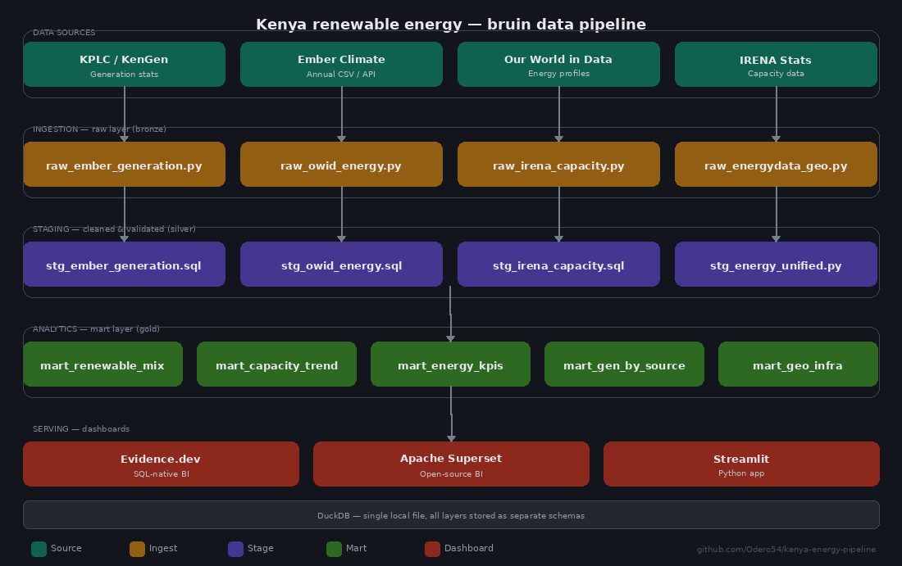

# Kenya Renewable Energy Data Pipeline

<div align="center">



**A production-grade open-source data pipeline tracking Kenya's journey to 100% renewable electricity by 2030.**

[](https://odero54.github.io/kenya-energy-pipeline/)
[](https://github.com/Odero54/kenya-energy-pipeline/)
[](https://creativecommons.org/licenses/by/4.0/)
[](https://github.com/bruin-data/bruin)

🔗 **Live dashboard:** https://odero54.github.io/kenya-energy-pipeline/
📁 **Repository:** https://github.com/Odero54/kenya-energy-pipeline/

</div>

---

## Objective

The objective of this project is to build a fully automated, batch open-source data pipeline that ingests, transforms, and visualises Kenya's renewable energy data — making it freely accessible to energy investors, government planners, development finance institutions, researchers, and the general public.

By combining data from four international open-data sources — Ember Climate, Our World in Data, IRENA, and the World Bank's EnergyData.info — the pipeline produces a live, queryable analytical layer covering Kenya's electricity generation mix, installed capacity by technology, carbon intensity, electricity access rates, and physical grid infrastructure. The dashboard rebuilds automatically every day, ensuring the data is always current.

This project was built as part of the **Data Engineering Zoomcamp** by [DataTalks.Club](https://datatalks.club), demonstrating how modern open-source data engineering tools can be applied to real-world energy challenges in Africa.

---

## Problem Statement

Kenya has made remarkable progress in renewable energy — over 91% of its electricity now comes from renewable sources, and the government has set an ambitious target of 100% renewable electricity by 2030. Yet despite this progress, a fundamental problem persists: **the data that should inform investment, policy, and planning decisions is scattered, inaccessible, and rarely visualised.**

Specifically:

- **Energy data is fragmented** across multiple international portals (IRENA, Ember, IEA, World Bank), each with different formats, update cycles, and access mechanisms. A policy analyst or investor wanting a complete picture of Kenya's energy system must manually download and reconcile data from at least four separate sources.

- **Geospatial infrastructure data is underutilised.** Kenya's transmission network, substation locations, and solar resource zones are available as open GeoJSON datasets — but they are almost never integrated into energy analytics. This means grid connectivity risks, siting costs, and infrastructure gaps remain invisible to most decision-makers.

- **There is no single, always-current analytical layer** that combines generation statistics, installed capacity, carbon intensity, electricity access rates, and physical infrastructure into one queryable, visualised system. Development finance institutions, independent power producers, and government planners must commission expensive consultant reports to get analysis that should be derivable from public data in hours.

- **The data engineering barrier is too high** for most African research institutions and government agencies. The tools that exist are either too expensive (commercial BI platforms), too complex (enterprise data warehouses), or not designed for the kind of cross-source, multi-format energy data that Africa's energy sector produces.

The result is a gap between the availability of open data and its actual use in decision-making — a gap that this project is designed to close.

---

## Proposed Solution

This project proposes a **fully automated, open-source medallion data pipeline** that eliminates the fragmentation, inaccessibility, and update-lag problems described above.

The solution has four components:

**1. Automated multi-source ingestion**
Python assets fetch data directly from Ember Climate's public CSV, Our World in Data's GitHub repository, IRENA's statistics portal, and EnergyData.info's CKAN API — on a daily schedule via GitHub Actions. No manual downloads. No stale spreadsheets.

**2. Standardised transformation and quality checks**
All data passes through a medallion architecture (Bronze → Silver → Gold) implemented in Bruin — an open-source CLI that handles ingestion, SQL and Python transformation, data quality checks, and orchestration in a single framework. Every asset enforces quality constraints: null checks, range validation, uniqueness, and capacity utilisation bounds. Bad data is flagged before it reaches the dashboard.

**3. A live geospatial + statistical dashboard**
Five Evidence.dev pages — built in SQL and Markdown, deployed as a static site on GitHub Pages — give any user browser-level access to Kenya's full energy picture: generation mix over 25 years, installed capacity trends, carbon intensity, electricity access progression, and an interactive transmission network map showing 83 KPLC substations and thousands of line segments.

**4. A replicable architecture for the rest of Africa**
Every component is open source, runs on a laptop, and costs nothing to operate. The pipeline can be adapted to any African country with open energy data by changing a country code and updating the IRENA fallback table. This is not a Kenya-specific tool — it is a template for continent-wide energy transparency.

---

## Architecture


The pipeline follows a **medallion architecture** across four layers, all stored in a single DuckDB file:

| Layer | Schema | What happens |
|---|---|---|
| **Bronze** | `ingestion` | Raw data fetched from Ember, OWID, IRENA, EnergyData.info |
| **Silver** | `staging` | Cleaned, normalised, joined — quality checks enforced |
| **Gold** | `mart` | Business-ready aggregations: mix, capacity, KPIs, geo |
| **Serving** | — | Evidence.dev static dashboard, deployed via GitHub Pages |

**Storage:** Single DuckDB file (`kenya_energy.db`) — schemas: `ingestion` → `staging` → `mart`

---

## Technologies Used

| Tool | Role | Why it was chosen |
|---|---|---|
| [Bruin](https://github.com/bruin-data/bruin) | Pipeline orchestration, ingestion, transformation, quality checks | Single CLI replacing Airflow + dbt + Great Expectations. Open source, runs locally, Git-native. |
| [DuckDB](https://duckdb.org) | Local analytical warehouse | In-process OLAP database. Zero infrastructure, full SQL, handles multi-GB data on a laptop. |
| [MotherDuck](https://motherduck.com) | Cloud extension of DuckDB (optional) | Same SQL, same workflow — shared and serverless for team environments. |
| [Evidence.dev](https://evidence.dev) | Dashboard / BI layer | SQL + Markdown → static site. No JavaScript required, deploys to GitHub Pages for free. |
| [GitHub Actions](https://github.com/features/actions) | CI/CD and scheduled pipeline runs | Free, cloud-hosted runner. Rebuilds the full pipeline and dashboard daily at 06:00 UTC. |
| [uv](https://github.com/astral-sh/uv) | Python dependency management | Fast, modern replacement for pip + virtualenv. Single `uv sync` installs everything. |
| [Python 3.11](https://www.python.org) | Ingestion assets and data joining | Used for API calls, DataFrame manipulation, CUF computation, and geospatial data processing. |
| [pandas](https://pandas.pydata.org) | Data wrangling | Column normalisation, type casting, source joins. |
| [GeoPandas / Shapely](https://geopandas.org) | Geospatial processing | Parses OGC-compliant GeoJSON from EnergyData.info into flat records for DuckDB. |
| [pytest + ruff](https://docs.pytest.org) | Testing and linting | 48 test cases across ingestion, staging, and mart layers. Ruff enforces code quality. |

**Data sources (all open access):**

| Source | What it provides | License |
|---|---|---|
| [Ember Climate](https://ember-energy.org/data/yearly-electricity-data/) | Generation (TWh), capacity (MW), emissions, demand — 215 countries | CC BY 4.0 |
| [Our World in Data](https://github.com/owid/energy-data) | 130+ indicators: per-capita kWh, carbon intensity, renewable share, access % | CC BY 4.0 |
| [IRENA](https://www.irena.org/Data) | Installed renewable capacity (MW) by technology, 2000–present | Free, attribution |
| [EnergyData.info](https://energydata.info/dataset?vocab_country_names=KEN) | Transmission network, substations, solar radiation stations (GeoJSON/CSV) | CC BY 4.0 |

---

## Impact: How This Helps Energy Stakeholders and the Government of Kenya

### For Energy Investors and Independent Power Producers (IPPs)

Investment decisions in Kenya's energy sector require understanding where generation capacity exists, where the grid can absorb new connections, what tariff environments look like, and how carbon intensity is trending. This pipeline surfaces all of these dimensions from a single dashboard — without a consultant, without a data licence, and without a six-week due diligence timeline.

The geospatial infrastructure layer is particularly valuable: with 83 KPLC substations mapped and over 3.4 million transmission line features queryable by voltage class, an IPP evaluating a solar project in Turkana County can assess grid connectivity risk in minutes rather than months.

Institutions such as Actis, CrossBoundary Energy, Africa50, Norfund, the African Development Bank, and the IFC — all active in Kenya's energy sector — can use this pipeline as a first-pass analytical layer before committing to deeper due diligence.

### For the Government of Kenya and Sector Regulators

Kenya's Ministry of Energy, EPRA, KenGen, KPLC, KETRACO, GDC, and REREC all operate with the same fragmented data landscape described in the problem statement. This pipeline gives government planners:

- **A 2030 progress tracker** — the `gap_to_100pct_target` metric updates daily, giving a clear picture of how many percentage points remain to Kenya's 100% renewable electricity target.
- **County-level infrastructure visibility** — the geospatial layer maps substations by county and ownership, supporting the Ministry's rural electrification planning and the Last Mile Connectivity Programme.
- **Carbon intensity monitoring** — the `carbon_intensity_gco2_kwh` time series supports Kenya's NDC reporting obligations and tracking under the Paris Agreement.
- **ESG-ready data** — development finance institutions require scope 2 emissions data for portfolio companies on the Kenyan grid. This pipeline provides the carbon intensity denominator for those calculations.

### For Energy Researchers and Academia

The pipeline produces 25 years of clean, structured, annually updated data across five mart tables — all queryable via SQL. Researchers studying Kenya's energy transition, geothermal economics, off-grid solar adoption, or East African Power Pool interconnection can use this as a ready-made analytical baseline.

### For Data Engineers and the African Tech Community

This project demonstrates that a single data engineer — with a laptop, open-source tools, and publicly available data — can build production-grade energy analytics for an entire country at zero infrastructure cost. The architecture (Bruin + DuckDB + Evidence.dev + GitHub Actions) is directly transferable to any African country with open energy data on IRENA and EnergyData.info. Fork the repository, change the country code, and you have the same analytical layer for Nigeria, Ethiopia, South Africa, Ghana, Tanzania, or Uganda.

---

## Project Structure

```
kenya-energy-pipeline/
│
├── .bruin.yml                          # DuckDB connection config
├── pipeline.yml                        # Pipeline name + schedule
├── pyproject.toml                      # uv / Python deps (uv sync)
├── Makefile                            # Common operations
├── docs/
│   └── architecture.png               # Pipeline architecture diagram
│
├── seeds/
│   └── source_categories.csv           # Energy source → category/color lookup
│
├── assets/
│   ├── ingestion/                      # Bronze layer — raw data fetch
│   │   ├── raw_ember_generation.py     # Ember yearly CSV (Kenya filtered)
│   │   ├── raw_owid_energy.py          # OWID GitHub CSV (Kenya filtered)
│   │   ├── raw_irena_capacity.py       # IRENA capacity (API + curated fallback)
│   │   └── raw_energydata_geo.py       # EnergyData.info CKAN API (GeoJSON/CSV)
│   │
│   ├── staging/                        # Silver layer — clean + normalise
│   │   ├── stg_source_categories.sql   # Seed loader
│   │   ├── stg_ember_generation.sql    # Ember: clean, flag renewable/fossil
│   │   ├── stg_owid_energy.sql         # OWID: select & round KPI columns
│   │   ├── stg_irena_capacity.sql      # IRENA: map tech labels, validate MW
│   │   └── stg_energy_unified.py       # JOIN Ember + IRENA + OWID, add CUF
│   │
│   └── analytics/                      # Gold layer — business marts
│       ├── mart_renewable_mix.sql       # Yearly gen by source + share %
│       ├── mart_capacity_trend.sql      # MW trend + YoY additions + CUF
│       ├── mart_energy_kpis.sql         # KPIs: access, per-capita, CO₂, 2030 gap
│       ├── mart_generation_by_source.sql # Long-format for charting
│       └── mart_geo_infrastructure.sql  # Infrastructure feature counts
│
├── tests/
│   ├── test_ingestion.py               # Kenya-only filter, columns, value ranges
│   ├── test_staging.py                 # Normalisation, CUF bounds, deduplication
│   └── test_marts.py                   # Aggregations, YoY, share % sums
│
└── dashboard/                          # Evidence.dev app
    ├── sources/kenya_energy/           # DuckDB connection + source queries
    │   ├── connection.yaml
    │   ├── renewable_mix.sql
    │   ├── capacity_trend.sql
    │   ├── energy_kpis.sql
    │   └── generation_by_source.sql
    └── pages/
        ├── index.md                    # Main dashboard: mix + 2030 progress
        ├── capacity.md                 # Installed capacity + CUF
        ├── kpis.md                     # Access, per-capita, carbon intensity
        ├── sources.md                  # Source-level explorer with filters
        └── geo-infrastructure.md       # Infrastructure map: substations, lines
```

---

## Quick Start

### 1. Install dependencies

```bash
# Install uv
curl -LsSf https://astral.sh/uv/install.sh | sh

# Install Bruin CLI
curl -fsSL https://raw.githubusercontent.com/bruin-data/bruin/main/install.sh | sh

# Sync all Python deps
uv sync

# Node (for Evidence.dev dashboard) — requires Node.js >= 18
cd dashboard && npm install
```

Or in one command:

```bash
make setup
```

### 2. Validate the pipeline

```bash
bruin validate .
```

### 3. Run the full pipeline

```bash
export BRUIN_PYTHON="uv run python"
make run
```

### 4. Start the dashboard

```bash
make dashboard      # opens http://localhost:3000
```

### 5. Full refresh after new data

```bash
make refresh        # = make run && make sources
```

---

## Dashboard Pages

| Page | URL | What it shows |
|---|---|---|
| Overview | `/` | Generation mix, 2030 target progress, YoY change |
| Installed Capacity | `/capacity` | MW by technology, additions, CUF |
| Energy KPIs | `/kpis` | Access rate, per-capita, carbon intensity |
| Source Explorer | `/sources` | Filterable by decade, renewable vs fossil |
| Geo Infrastructure | `/geo-infrastructure` | Transmission network, substations map |

---

## CI/CD — GitHub Actions

The pipeline runs automatically on every push to `main` and rebuilds daily at 06:00 UTC:

1. Installs Python 3.11, uv, Bruin CLI, and Node.js 20
2. Validates all pipeline assets (`bruin validate .`)
3. Runs the full Bruin pipeline (`bruin run pipeline.yml`)
4. Builds the Evidence.dev static dashboard (`npm run build`)
5. Deploys to GitHub Pages

Trigger a manual run from the [Actions tab](https://github.com/Odero54/kenya-energy-pipeline/actions) or push with:

```bash
make deploy
```

---

## Key Metrics Produced

| Metric | Mart | Description |
|---|---|---|
| `renewable_share_pct` | `mart.renewable_mix` | Renewable % of total generation |
| `renewable_share_yoy_pp` | `mart.renewable_mix` | YoY change in renewable share (pp) |
| `total_renewable_mw` | `mart.capacity_trend` | Total installed renewable capacity |
| `mw_added_yoy` | `mart.capacity_trend` | New MW installed per year |
| `capacity_utilisation_factor` | `mart.capacity_trend` | CUF per technology |
| `access_to_electricity_pct` | `mart.energy_kpis` | % population with electricity |
| `per_capita_elec_kwh` | `mart.energy_kpis` | kWh per person per year |
| `carbon_intensity_gco2_kwh` | `mart.energy_kpis` | Grid carbon intensity |
| `gap_to_100pct_target` | `mart.energy_kpis` | Percentage points to Kenya's 2030 goal |

---

## Data Quality Checks

Every Bruin asset enforces quality constraints before data reaches the dashboard:

- `not_null` on `year`, `source_type`, `generation_twh`
- `accepted_range` on year (2000–2030), `renewable_share_pct` (0–100)
- `unique` on `year` in mart tables
- Negative generation values nullified for non-import rows
- CUF clamped to [0, 1]

```bash
bruin run --only-checks pipeline.yml
```

---

## Testing

```bash
uv run pytest tests/ -v                              # all 48 tests
uv run pytest tests/ --cov=assets --cov-report=term-missing
uv run ruff check assets/                            # lint
uv run mypy assets/                                  # type-check
```

---

## Acknowledgements

This project was built as part of the **[Data Engineering Zoomcamp](https://datatalks.club/blog/data-engineering-zoomcamp.html)** by **[DataTalks.Club](https://datatalks.club)**. A sincere thank you to **Alexey Grigorev** and the entire DataTalks.Club community for keeping this course completely open and free — making production-grade data engineering skills accessible to practitioners across Africa and the world.

---

## Licenses

All source data is open access:

| Source | License |
|---|---|
| Ember Climate | CC BY 4.0 |
| Our World in Data | CC BY 4.0 |
| IRENA | Free for non-commercial use with attribution |
| EnergyData.info (World Bank) | CC BY 4.0 |

Please credit sources when publishing dashboards or reports derived from this pipeline.

---

*Built with ❤️ for Pan-Africanists building Africa's energy future.*